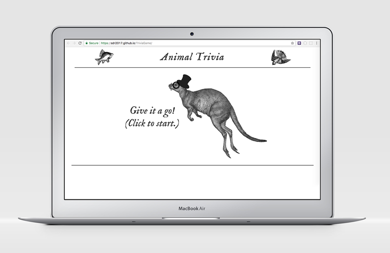
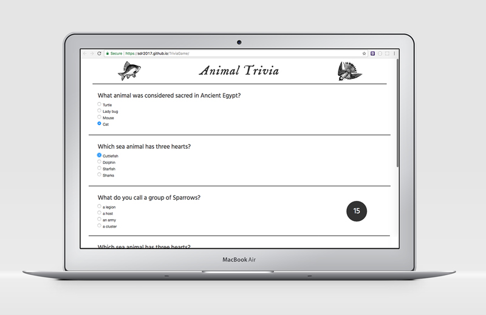

# Animal Trivia

This is a simple trivia game about animals. The user is presented with 5 random multiple choice questions and given 30 seconds to answer. If time runs out or the user finishes, they are taken to a results page, which shows their correct, incorrect, and unanswered totals with a corresponding graphic. After a few seconds, they are taken back for another round of questions. 

## Technologies Used
The app is built with HTML, CSS, Bootstrap for layout, and JavaScript and jQuery for functionality.

---

To view the app, click here:
https://sdr2017.github.io/TriviaGame/

Device mockups from www.pixeden.com